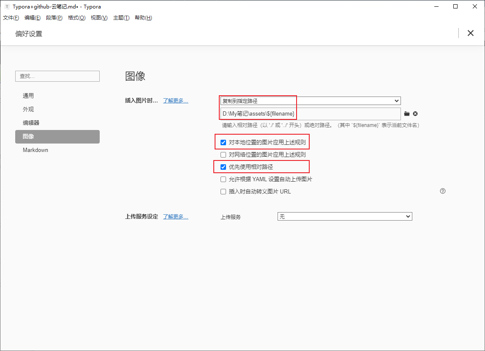

# 1.Typora设置





# 2.GitHub配置

## 2.1 生成ssh公钥，使用shh公钥不需要每次向github提交都输入密码

```shell
打开git bash 输入下列代码
设置全局的用户名和邮箱，每次提交的时候的信息
git config --global user.email "wnyrng@gmail.com"
git config --global user.name "wnyrng"


生成ssh登录公钥和私钥
ssh-keygen -t rsa -C "github-sshkey"

ssh-keygen -t rsa -f  E:\test   -C "test key"

ssh-keygen -t rsa -f  ~/.ssh/test   -C "test key"
代码参数含义：
-t 指定密钥类型，默认是 rsa ，可以省略。
-C 设置注释文字，比如邮箱。
-f 指定密钥文件存储文件名。

执行命令后需要进行3次或4次确认：

1.确认秘钥的保存路径（如果不需要改路径则直接回车）；
2. 如果上一步置顶的保存路径下已经有秘钥文件，则需要确认是否覆盖（如果之前的秘钥不再需要则直接回车覆盖，如需要则手动拷贝到其他目录后再覆盖）；
3.创建密码（如果不需要密码则直接回车）；（该密码是你push文件的时候要输入的密码，而不是github管理者的密码）
当然，你也可以不输入密码，直接按回车。那么push的时候就不需要输入密码，直接提交到github上了
这里我们选择按回车不输出密码
4. 确认密码；


执行完这个代码后在我们的用户目录下会生成一个.ssh的隐藏文件夹，文件夹里面有两个文件id_rsa和id_rsa.pub，前者是私钥，后者是公钥，复制id_rsa.pub的内容添加到github的ssh公钥处
目录.ssh下的文件说明

id_rsa ：存放私钥的文件
id_rsa.pub ：存放公钥的文件
known_hsots ：可以保存多个公钥文件，每个访问过计算机的公钥(public key)都记录在~/.ssh/known_hosts文件中
authorized_keys ：A机器生成的公钥-->放B的机器.ssh下authorized_keys文件里，A就能免密访问B，但是B不能访问A。如果需要两台电脑互相访问均免密码。则需要重复上面的步骤（机器的配置刚好相反）。

ssh在建立连接的时候不指定-i参数会默认寻找 ~/.ssh/id_rsa
若是省略 -i 参数，则 ssh-copy-id 会将默认的密钥 ~/.ssh/id_rsa 对应的公钥交付给远程主机。
```

## 2.2快速获得ssh公钥

```shell
git config --global user.email "youxiang"
git config --global user.name "user"
ssh-keygen -t rsa -C "sshkey"
$sshtext=(cat ~/.ssh/id_rsa.pub)
echo $sshtext
pause
```

## 2.3一些其他杂项知识记录

```shell
echo %path%
set PATH="%PATH%C:\git\cmd" 

setx PATH "%PATH%;C:\git\cmd" /m


set命令：这种语法只能在Cmd Shell环境中有效，关闭运行环境环境变量将不保存。
setx命令：永久设定环境变量。setx设置环境变量后，将在新打开的终端中生效，当前终端不会立即生效。
/m 表示添加到系统环境变量

/m 表示添加到系统环境变量
$Env:path=$Env:Path+";C:\git\cmd"  
```

# 3.github添加公钥+建立仓库

略......

# 4.初始化和远程同步

```shell
在笔记文件夹目录下 打开git bash 输入下列命令初始化本地仓库
git init 
```

```shell
将笔记本文件夹下所有文件进行跟踪，提交所有变化

git add -A  提交所有变化

其他命令：
git add -u  提交被修改(modified)和被删除(deleted)文件，不包括新文件(new)

git add .  提交新文件(new)和被修改(modified)文件，不包括被删除(deleted)文件
```

```shell
生成一个本地库版本

git commit -m "提交注释"
```

```shell
将本地库版本推送到github中
git push git@github.com:wnyrng/notebook.git  master
```

官方推荐的方法

```shell
# 初次生成仓库上传
git init
git add []
git commit -m "first commit"
git branch -M main
git remote add origin git@github.com:wnyrng/notebook.git #添加远程仓库
git push -u origin main
```

```shell
git remote add origin git@github.com:wnyrng/notebook.git
git branch -M main
git push -u origin main
```


# 5.注意事项

## 5.1 笔记文件名不要包含空格，如果有空格那么上传到github中预览的时候将无法看到图片
## 5.2 笔记文件名不要太长，太长也会出现上述问题

# 6.额外说明-把图片和笔记分开存放

上面的笔记搭建是图片和笔记都存放在本地，然后一起推送到远程仓库，但这样做有个问题，当我们写了比较多的笔记，这时候图片就会占据大量的空间，github一个仓库1G（超过1G会收到邮件）

## 6.1 准备软件

**PicGo软件，一款把图片上传到图床的软件，typora现在的版本可以和这个该软件配合轻松自动上传**

如图所示，现在版本可以选择上传服务

